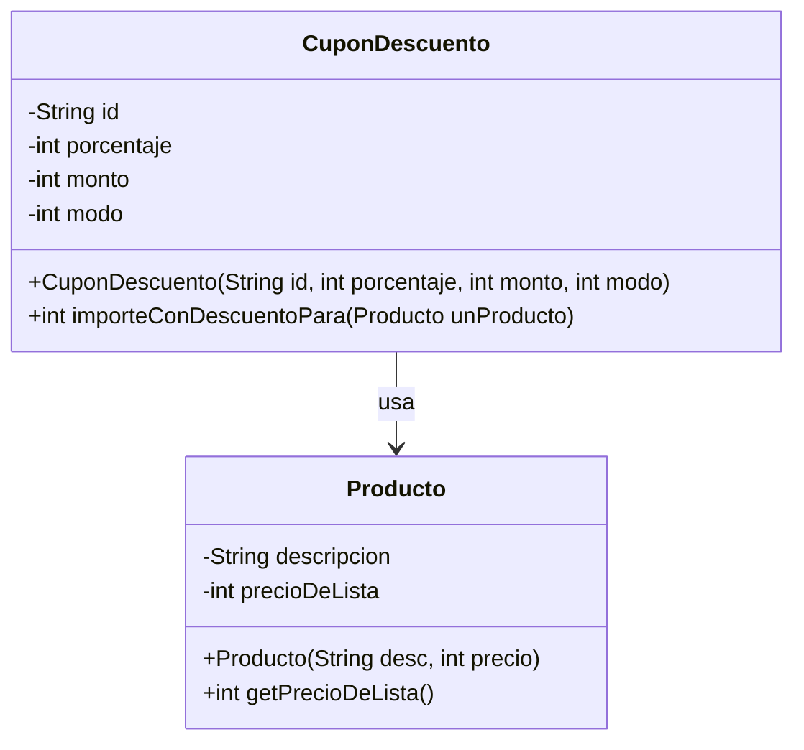

# Diagrama de Clases - Clase 03

## Descripción del Sistema
Sistema de productos con cupones de descuento que permite aplicar descuentos por porcentaje o por monto fijo.

## Diagrama de Clases



## Descripción de las Clases

### Clase `Producto`
- **Propósito**: Representa un producto con descripción y precio
- **Atributos**:
  - `descripcion`: Descripción del producto (String)
  - `precioDeLista`: Precio base del producto (int)
- **Métodos**:
  - `Producto(String desc, int precio)`: Constructor
  - `getPrecioDeLista()`: Getter para obtener el precio

### Clase `CuponDescuento`
- **Propósito**: Representa un cupón que puede aplicar descuentos a productos
- **Atributos**:
  - `id`: Identificador del cupón (String)
  - `porcentaje`: Porcentaje de descuento (int)
  - `monto`: Monto fijo de descuento (int)
  - `modo`: Tipo de descuento (1: porcentaje, 2: monto fijo)
- **Métodos**:
  - `CuponDescuento(String id, int porcentaje, int monto, int modo)`: Constructor
  - `importeConDescuentoPara(Producto unProducto)`: Calcula el precio con descuento

## Relaciones

1. **CuponDescuento → Producto**: La clase `CuponDescuento` usa la clase `Producto` para calcular descuentos

## Ejemplo de Uso

```java
// Crear productos
Producto galaxyA15 = new Producto("Celular Samsung GalaxyA15", 249990);
Producto iPhone16 = new Producto("Celular iPhone 16 Pro", 440000);

// Crear cupones
CuponDescuento cupon10off = new CuponDescuento("2d33s", 10, 0, 1);      // 10% descuento
CuponDescuento cupon20000Ars = new CuponDescuento("2d33s", 0, 20000, 2); // $20000 descuento

// Aplicar descuentos
int precioConDescuento1 = cupon10off.importeConDescuentoPara(galaxyA15);
int precioConDescuento2 = cupon20000Ars.importeConDescuentoPara(iPhone16);
```

## Notas de Implementación

- Los cupones pueden funcionar en dos modos:
  - **Modo 1**: Descuento por porcentaje
  - **Modo 2**: Descuento por monto fijo
- Los precios se manejan como enteros (centavos o unidad mínima de moneda)
- El sistema permite múltiples tipos de cupones con diferentes estrategias de descuento
