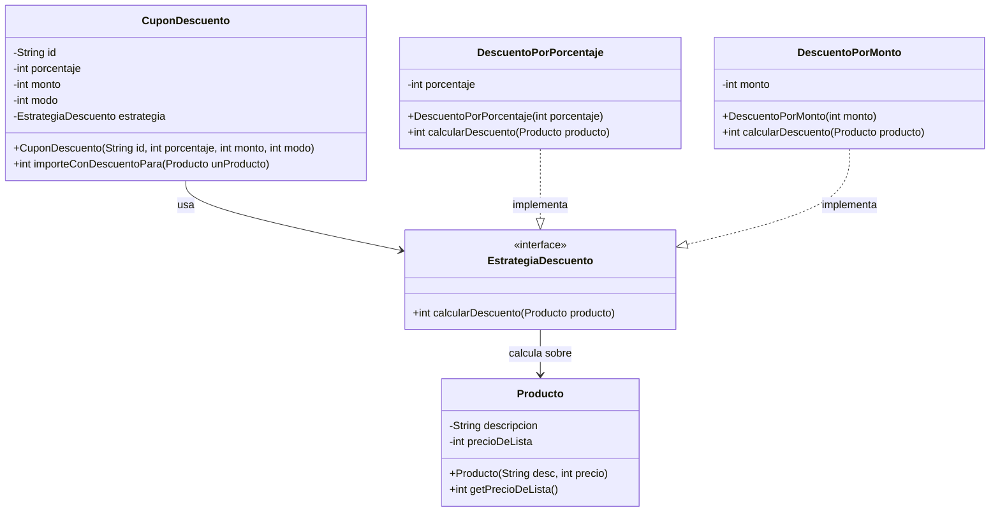

# Diagrama de Clases con Patrón Strategy - Clase 03

## Descripción del Sistema
Sistema de productos con cupones de descuento refactorizado usando el patrón Strategy. Este diseño permite agregar nuevos tipos de descuento sin modificar las clases existentes.

## Diagrama de Clases (Después del Strategy Pattern)

```mermaid
classDiagram
    class Producto {
        -String descripcion
        -int precioDeLista
        +Producto(String desc, int precio)
        +int getPrecioDeLista()
    }
    
    class CuponDescuento {
        -String id
        -int porcentaje
        -int monto
        -int modo
        -EstrategiaDescuento estrategia
        +CuponDescuento(String id, int porcentaje, int monto, int modo)
        +int importeConDescuentoPara(Producto unProducto)
    }
    
    class EstrategiaDescuento {
        <<interface>>
        +int calcularDescuento(Producto producto)
    }
    
    class DescuentoPorPorcentaje {
        -int porcentaje
        +DescuentoPorPorcentaje(int porcentaje)
        +int calcularDescuento(Producto producto)
    }
    
    class DescuentoPorMonto {
        -int monto
        +DescuentoPorMonto(int monto)
        +int calcularDescuento(Producto producto)
    }
    
    CuponDescuento --> EstrategiaDescuento : usa
    EstrategiaDescuento --> Producto : calcula sobre
    DescuentoPorPorcentaje ..|> EstrategiaDescuento : implementa
    DescuentoPorMonto ..|> EstrategiaDescuento : implementa
```

## Descripción de las Clases

### Clase `Producto`
- **Propósito**: Representa un producto con descripción y precio
- **Atributos**:
  - `descripcion`: Descripción del producto (String)
  - `precioDeLista`: Precio base del producto (int)
- **Métodos**:
  - `Producto(String desc, int precio)`: Constructor
  - `getPrecioDeLista()`: Getter para obtener el precio

### Interface `EstrategiaDescuento`
- **Propósito**: Define el contrato para las diferentes estrategias de descuento
- **Métodos**:
  - `calcularDescuento(Producto producto)`: Calcula el precio con descuento aplicado

### Clase `DescuentoPorPorcentaje`
- **Propósito**: Implementa la estrategia de descuento por porcentaje
- **Atributos**:
  - `porcentaje`: Porcentaje de descuento a aplicar (int)
- **Métodos**:
  - `DescuentoPorPorcentaje(int porcentaje)`: Constructor
  - `calcularDescuento(Producto producto)`: Aplica descuento por porcentaje

### Clase `DescuentoPorMonto`
- **Propósito**: Implementa la estrategia de descuento por monto fijo
- **Atributos**:
  - `monto`: Monto fijo de descuento (int)
- **Métodos**:
  - `DescuentoPorMonto(int monto)`: Constructor
  - `calcularDescuento(Producto producto)`: Aplica descuento por monto fijo

### Clase `CuponDescuento`
- **Propósito**: Contexto del patrón Strategy que delega el cálculo de descuento a la estrategia apropiada
- **Atributos**:
  - `id`: Identificador del cupón (String)
  - `porcentaje`: Porcentaje de descuento (int) - mantenido por compatibilidad
  - `monto`: Monto fijo de descuento (int) - mantenido por compatibilidad
  - `modo`: Tipo de descuento (int) - mantenido por compatibilidad
  - `estrategia`: Estrategia de descuento a utilizar (EstrategiaDescuento)
- **Métodos**:
  - `CuponDescuento(String id, int porcentaje, int monto, int modo)`: Constructor que crea la estrategia apropiada
  - `importeConDescuentoPara(Producto unProducto)`: Delega el c√°lculo a la estrategia

## Relaciones

1. **CuponDescuento → EstrategiaDescuento**: Composición - El cupón usa una estrategia para calcular descuentos
2. **EstrategiaDescuento ‚Üí Producto**: Dependencia - Las estrategias necesitan el producto para calcular el descuento
3. **DescuentoPorPorcentaje ⇢ EstrategiaDescuento**: Implementación - Estrategia concreta por porcentaje
4. **DescuentoPorMonto ⇢ EstrategiaDescuento**: Implementación - Estrategia concreta por monto

## Ventajas del Patrón Strategy Aplicado

### ‚úÖ Beneficios obtenidos:

1. **Extensibilidad**: Fácil agregar nuevos tipos de descuento sin modificar código existente
2. **Separación de responsabilidades**: Cada estrategia maneja un tipo específico de descuento
3. **Eliminación de condicionales**: No más if/else en el método principal
4. **Polimorfismo**: Las estrategias se comportan de manera uniforme a través de la interfaz
5. **Principio Abierto/Cerrado**: Abierto para extensión, cerrado para modificación

### 🔄 Comparación con el diseño anterior:

- **Antes**: Un método con múltiples condicionales para diferentes tipos de descuento
- **Después**: Estrategias separadas que implementan cada tipo de descuento

### üöÄ Escalabilidad:

Para agregar un nuevo tipo de descuento (ej: descuento por cantidad), solo se necesita:
1. Crear una nueva clase que implemente `EstrategiaDescuento`
2. Agregar un nuevo caso en el constructor de `CuponDescuento`
3. No modificar ninguna otra clase existente

## Compatibilidad

- **API pública mantenida**: El método `importeConDescuentoPara()` funciona exactamente igual
- **Constructor sin cambios**: Se mantiene la misma signatura del constructor
- **Main sin modificar**: El código cliente no requiere cambios
